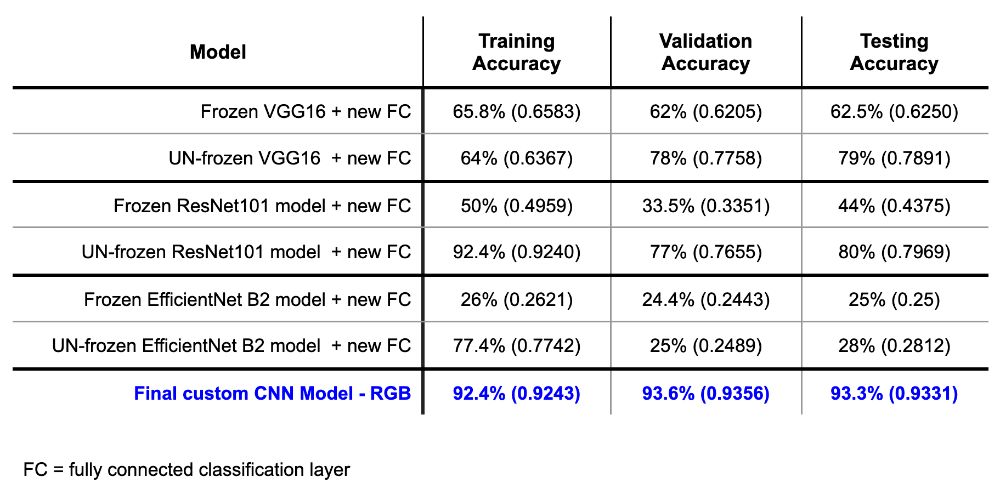

# **Capstone Project: Deep Learning Methods for Facial Emotion Recognition**
## **Monica Palacios Boyce**

 MIT Applied Data Science Program

------
### **Project files include:**

- <a href="pdf/NEW_MPB_PRESENTATION_CAPSTONE.pdf">UPDATED Slide presentation on Transfer Learning Model Optimization</a>. Since the completion of this course, I have gone back and examined issues I had with the transfer learning aspects of this project. Please see these slides for a treatment on what I have learned. Provided here as a PDF.
  - Related jupyter notebooks:
    - <a href="https://github.com/MPBDS2022/Data-Science/blob/main/capstone/VGG16_modded_CAPSTONE.ipynb">VGG16 optimization</a>
    - <a href="https://github.com/MPBDS2022/Data-Science/blob/main/capstone/RESNET_modded_CAPSTONE.ipynb">ResNet101 optimization</a>
    - <a href="https://github.com/MPBDS2022/Data-Science/blob/main/capstone/EFFICIENTNET_modded_CAPSTONE.ipynb">EfficientNet B2 optimization</a>
 
 
- <a href="pdf/MPB_capstone_presentation.pdf">Slide presentation</a> for this capstone project. This was presented live before a panel of program evaluators. Provided here as a PDF.
  - Related jupyter notebook
    - <a href="https://github.com/MPBDS2022/Data-Science/blob/main/capstone/MPB_capstone_code.ipynb">Final code submitted for this project</a>

- The <a href="pdf/MPB-capstone-REPORT.pdf">Capstone Final Report</a>. This concise 9 page report includes:
  - Executive Summary 
  - Problem Summary
  - Solution Design
  - Analysis and Key Insights
  - Key Limitations
  - Key Recommendations for Further Analysis and Implementation
  - Bibliography

-  <a href="https://github.com/MPBDS2022/Data-Science/blob/main/capstone/MPB_capstone_code.ipynb">Convolutional Neural Network model build and performance testing code</a>

--------

# Executive Summary

--------

This project aims to construct a best-fit Convolutional Neural Network (CNN) model that accurately performs multi-class classification for facial emotion recognition. Specifically, the model must accurately detect four specific emotions in images of people, including: ‘happy’, ‘sad’, ‘neutral’, and ‘surprise’ from the FER 2013 dataset (>30,000 images). To this end, a series of CNN models were designed, optimized and evaluated. Transfer learning strategies were also employed, utilizing the pre-trained feature-extraction layers of well tested high performance CNNs, namely, VGG16, ResNet 101, and EfficientNet B2. Finally, a deeper complex CNN was designed and assessed for accuracy of multi-classification of facial characteristic - emotional state encoding or recognition.

--------

Of the models assessed, the final custom CNN model was identified as the best performance for the stated purpose, with a overall ~93% accuracy of discriminating correct emotions on a test set of facial images. This model was able to generalize well from its training and validation performance to testing performance. In terms of key takeaways, factors that impact model performance on test images include suboptimal training due to dataset issues that include a certain amount of labeling error in the FER 2013 dataset (as is the case with any dataset), inherent ambiguity of facial characteristics for certain more subtle emotions, the potential for culture specific nuances in surface emotional expression, and data sparsity, to name several. Another important dataset related issue is well known demographic bias with respect to imbalances in gender, race, age and other factors that lead to reduced accuracy of model training.

--------

Key next steps to mitigate these known issues could involve: increasing the size of the dataset, increasing the accuracy of dataset labeling, correction of bias by balancing demographic factors (equal representation of genders, ages, and racial phenotypes), and using transfer learning.

--------

Various levels of performance were acheived with transfer learning models. Both frozen and unfrozen methods were used. Performance of these models remained below that of the custom built CNN model mentioned herein. Refer to data table shown above.

--------

The final model has a sufficient level of performance (~93%) that can be further optimized during model training by using other larger image datasets for training, such as ImageNet (>14 million annotated images), CelebA (>202,000 annotated images), FFHQ(Flickr-Faces-HQ, 70,000 high resolution diverse image set), to name a few.

-------
## **The Tech Stack for this project includes:**

- <a href="https://www.python.org" target="_blank" rel="noreferrer">Python</a>
- <a href="https://numpy.org/" target="_blank" rel="noreferrer">Numpy</a>
- <a href="https://matplotlib.org/" target="_blank" rel="noreferrer">matplotlib</a>
- <a href="https://pandas.pydata.org/" target="_blank" rel="noreferrer">Pandas</a>
- <a href="https://seaborn.pydata.org/" target="_blank" rel="noreferrer">Seaborn</a>
- <a href="https://scikit-learn.org/" target="_blank" rel="noreferrer">Scikit Learn</a>
- <a href="https://www.tensorflow.org" target="_blank" rel="noreferrer">TensorFlow</a>
- <a href="https://keras.io/" target="_blank" rel="noreferrer">Keras</a>

-------
## Connect with me:
- email: nika.boyce@gmail.com

- 
